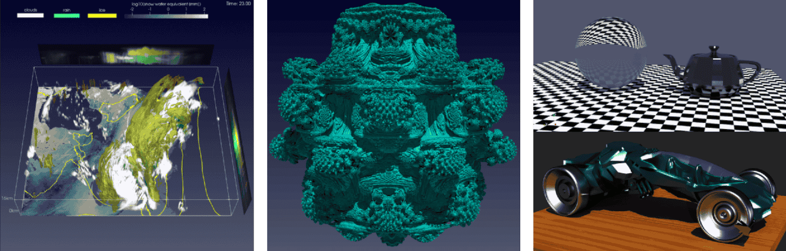
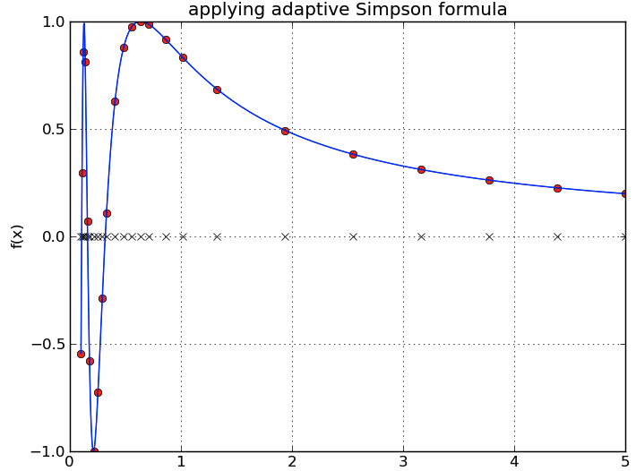

Introduction
============

`English <../en/1-introduction.html>`__

Équipe nationale de visualisation
---------------------------------

L’Alliance de recherche numérique du Canada offre non seulement des ressources
de calcul et de stockage à la communauté de la recherche, mais aussi des
formations et du soutien pour une utilisation efficace des ressources. Et l’une
des équipes de soutien se spécialise particulièrement en **visualisation
scientifique**.

- Documentation de l’Alliance : https://docs.alliancecan.ca/wiki/Visualization/fr
- Site Web externe : https://ccvis.netlify.app

  - `Qui sommes-nous <https://ccvis.netlify.app/about>`__?
  - `Compétitions de visualisation <https://ccvis.netlify.app/contests>`__ :

    - *Visualize This*, de 2016 à 2023
    - *IEEE SciVis*, en 2021

Visualisation scientifique de données définies dans l’espace
------------------------------------------------------------

C’est le processus permettant l’analyse de données sous une **forme visuelle**.

- Il est plus facile de comprendre des images que de grands ensembles de
  nombres.
- Cela permet d’explorer interactivement des données, de déboguer une analyse
  et de communiquer avec les pairs.

.. list-table::
    :header-rows: 1

    * - Domaine de recherche
      - Données à visualiser
    * - Mécanique des fluides
      - Écoulements 2D/3D, densité, température, traceurs
    * - Climat, météorologie, océanographie, intérieurs planétaires
      - Fluides dynamiques, nuages, chimie, etc.
    * - Astrophysique, de la formation des galaxies et des étoiles à
        l’hydrodynamique stellaire
      - Fluides 2D/3D, données particulaires, champ de rayonnement ≤6D, champs
        magnétiques, champs gravitationnels
    * - Chimie quantique
      - Fonctions d’onde 3D
    * - Dynamique moléculaire (physique, chimie, biologie)
      - Particules (atomes, molécules)
    * - Bioinformatique
      - Réseaux, arbres, séquences
    * - Imagerie médicale
      - IRM, CT scans, ultrason, données temporelles
    * - Systèmes d’information géographique
      - Altitude, rivières, villes, routes, strates, etc.
    * - Sciences humaines et sociales
      - Données abstraites, ou l’un des types ci-dessus

Traçage 1D/2D vs visualisation multi-dimensionnelle
---------------------------------------------------

Quelles sont les différences entre le traçage de graphiques 1D/2D et la
visualisation 2D/3D?

.. list-table::
    :header-rows: 1

    * - Traçage 1D/2D
      - Visualisation 2D/3D
    * - Créer des graphiques de données typiquement tabulaires
      - Afficher des ensembles de données multi-dimensionnelles, c’est-à-dire
        des données sur des grilles structurées (uniformes et multi-résolution)
        ou non structurées (selon une certaine topologie en 2D/3D)
    * - Jusqu’à quelques milliers de valeurs à la fois
      - Données potentiellement très massives (millions ou milliards de points)
    * - Création généralement rapide sur un ordinateur
      - Le rendu est souvent lourd sur CPU et/ou GPU
    * - Interaction optionelle pour comprendre les données
      - Besoin d’interagir en 3D, d’appliquer des filtres pour extraire des
        informations
    * - Bibliothèques fortement recommandées en **Python** :
        `Matplotlib <https://matplotlib.org>`__,
        `Seaborn <https://seaborn.pydata.org>`__,
        `Plotly <https://plotly.com/python>`__,
        `Bokeh <https://bokeh.org>`__,
        `Altair <https://altair-viz.github.io>`__,
        `Plotnine <https://plotnine.org>`__,
        `Holoviews <https://holoviews.org>`__.
        Bibliothèque recommandée en **R** :
        `ggplot2 <https://ggplot2.tidyverse.org>`__.
        Pour des graphes (réseaux) : `Gephi <https://gephi.org/>`__.
      - (*Nous verrons les deux outils les plus populaires dans les prochaines
        sections*)

Voici des exemples de traçages 1D/2D :

- **1D** : les valeurs dépendantes :math:`y = f(x)` ne sont que des valeurs
  **associées** aux coordonnées 1D selon :math:`(x,)`.

- **2D** : les couleurs ou les intensités de gradients sont **associées** aux
  coordonnées 2D selon :math:`(x,y)`.

Alors que plusieurs des outils mentionnés ci-haut permettent de générer ces
deux figures 1D/2D, que devrait-on utiliser pour faire de la visualization 3D?
Autant que possible, il vaut mieux éviter les outils propriétaires, sauf s’il y
a un réel avantage (probablement pas). Voici les raisons :

- Grande quantité d’argent à l’achat initial.
- La license peut imposer des limitations sur l’endroit où l’outil peut être
  utilisé, sur quel type de machine ou de plateforme, etc.
- La communauté utilisatrice est généralement plus petite que pour les outils à
  source ouvert, et il est plus difficile d’obtenir de l’aide.
- Une fois que vous commencez à accumuler des scripts, vous vous retrouvez
  contraint d’utiliser ces outils et, par conséquent, de payer régulièrement de
  l’argent.
