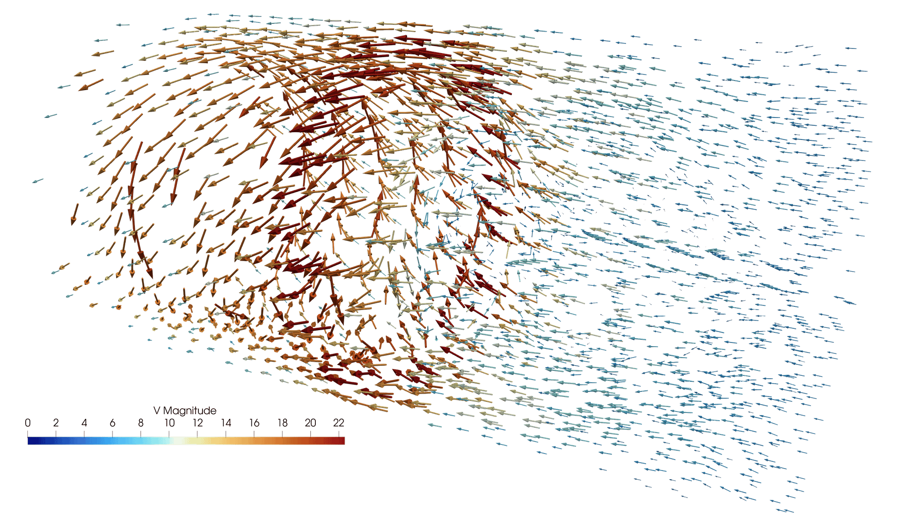
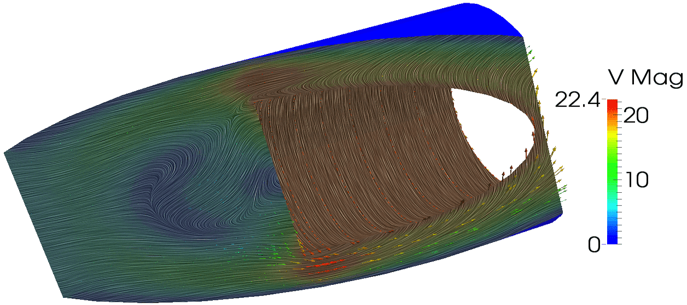

Enrichir la visualisation avec des filtres
==========================================

`English <../en/4-filters.html>`__

Introduction aux filtres
------------------------

Plusieurs caractéristiques intéressantes d’un ensemble de données ne peuvent
être observées en surface : une grande quantité d’informations utiles se
trouve plutôt **à l’intérieur**, ou peut être extraite d’une **combinaison de
variables**.

.. grid:: 2

    .. grid-item::
        :columns: 6

        Parfois, une vue souhaitée n’est pas disponible pour un certain type de
        données, par exemple :

        - Un ensemble de données 2D :math:`f(x,y)` sera affiché comme une
          surface 2D, même en 3D (essayez de charger
          ``~/prv101-main/lab/2d000.vtk``), mais nous pourrions vouloir
          visualiser **l’élévation** :math:`z=f(x,y)`.
        - Une **vue volumétrique** -- non disponible pour toutes les
          discrétisations VTK, mais disponible, entre autres, pour les **points
          structurés** (*Image Data*) et même les **grilles non structurées
          si la connectivité est fournie**.

    .. grid-item::
        :columns: 3

        .. figure:: ../images/grids1.png
            :width: 75%

    .. grid-item::
        :columns: 3

        .. figure:: ../images/grids2.png
            :width: 75%

Les **filtres** sont des unités fonctionnelles qui traitent les données pour
générer, extraire ou dériver des caractéristiques supplémentaires. Les
connexions entre les filtres forment un **pipeline de visualisation**.

- ParaView fournit déjà plus de 140 filtres et on peut en ajouter via des
  scripts Python ou via des plugiciels programmés en C++.

  - Tous les filtres se trouvent dans le menu *Filters*.
  - `Certains filtres
    <https://docs.paraview.org/en/latest/UsersGuide/filteringData.html#filters-for-sub-setting-data>`__
    se trouvent aussi dans la barre d’outils.

    .. figure:: ../images/toolbarFilters.png

    - Un filtre **Calculator** évalue une expression mathématique pour chaque
      point ou chaque cellule.
    - Un filtre **Contour** extrait des points, des isocontours ou des
      isosurfaces à partir d’un champ scalaire.
    - Un filtre **Clip** (rognage) enlève toute la partie de la visualisation
      d’un côté d’un plan dans l’espace 3D.
    - Un filtre **Slice** (tranche) intersecte la visualisation avec un plan ;
      l’effet est similaire au *Clip*, excepté qu’il ne reste que la géométrie
      à l’intersection du plan et de la visualisation.
    - Un filtre **Threshold** (seuil(s)) extrait les cellules se trouvant dans
      un certain intervalle du champ scalaire.
    - Un filtre **Glyph** place des *glyphes* à chaque point d’un maillage ;
      les glyphes peuvent être orientés selon un champ vectoriel et agrandis
      selon un champ vectoriel ou scalaire.
    - Un filtre **Stream Tracer** initialise un champ vectoriel avec des
      points, puis suit ces points initiaux à travers le champ vectoriel en
      régime permanent.

- L’édition des propriétés d’un filtre se fait dans le panneau *Properties*.

Exemple -- Visualiser des données 2D en 3D
''''''''''''''''''''''''''''''''''''''''''

1. Chargez le fichier ``~/prv101-main/lab/2d000.vtk`` qui contient un
   échantillonnage de la fonction 2D
   :math:`f(x,y)=(1-y)\sin(\pi x)+y\sin^2(2\pi x)` pour
   :math:`x,y\in[0,1]` sur une grille :math:`30 \times 30`.
2. Sélectionnez les données dans le *Pipeline Browser*, ajoutez le filtre
   *Miscellaneous* :math:`\rightarrow` *Warp By Scalar* et activez la vue *3D*
   dans la fenêtre de rendu.
3. Dans les propriétés du filtre, ajustez le *Scale Factor* à ``0.3`` pour
   reproduire la vue 3D ci-dessous :

.. grid:: 2

    .. grid-item::
        :columns: 4

        .. figure:: ../images/sin2d.png

    .. grid-item::
        :columns: 1

        |
        |
        |
        | :math:`\Rightarrow`

    .. grid-item::
        :columns: 7

        .. figure:: ../images/sin3d.png

Exemple -- Optimisation 3D
''''''''''''''''''''''''''

Pour tester des algorithmes d’optimisation, il existe plusieurs `fonctions de
test <https://fr.wikipedia.org/wiki/Fonction_de_test_pour_l'optimisation>`__,
dont la fonction 3D de Styblinski-Tang :

.. math::

    f(x_1,x_2,x_3)=\frac{1}{2}\sum_{i=1}^3(x_i^4-16x_i^2+5x_i)\text{,
    où }x_i\in[-5,5]

Une variante discrétisée de cette fonction (avec :math:`x_i\in[-4,4]`) se
trouve dans le fichier ``~/prv101-main/lab/stvol.nc``.

- Quelle est la taille de la grille? Est-ce que cela correspond à la taille du
  fichier?
- Trouvons l’emplacement approximatif du **minimum global** de
  :math:`f(x_1,x_2,x_3)` à l’aide de techniques visuelles (tranches,
  isosurfaces, seuils, rendu volumique, etc.)

.. note::

    On peut trouver les coordonnées exactes du minimum global en utilisant
    *Filters* :math:`\rightarrow` *Data Array* :math:`\rightarrow` *Statistics*
    :math:`\rightarrow` *Descriptive Statistics* et en triant les valeurs de
    :math:`f(x,y,z)` de ``stvol.nc``.

Quelques exercices avec les filtres
-----------------------------------

Recréez cette visualisation avec un filtre *Contour*
''''''''''''''''''''''''''''''''''''''''''''''''''''

.. grid:: 2

    .. grid-item::
        :columns: 6

        - Données à la source : ``~/prv101-main/lab/sineEnvelope.nc``
        - Indices :

          - Filtre de type *Contour*.
          - Isosurface à ``0.16``.
          - Échelle de couleurs de ``0.15`` à ``0.20``.

        *(3 minutes + solution)*

    .. grid-item::
        :columns: 5

        .. figure:: ../images/cont015.png

Bonifiez la visualisation avec un filtre *Clip*
'''''''''''''''''''''''''''''''''''''''''''''''

.. grid:: 2

    .. grid-item::
        :columns: 7

        - Données à la source : ``~/prv101-main/lab/sineEnvelope.nc``
        - Indices :

          - Pipeline de visualisation à deux filtres.
          - Filtre de type *Clip*.
          - L’échelle de couleurs selon la variable *density*, partagée par les
            deux calculateurs, s’ajuste automatiquement.
          - Option *Show Plane*.

        *(3 minutes + solution)*

    .. grid-item::
        :columns: 5

        .. figure:: ../images/clipCont.png

Recréez cette visualisation avec un filtre *Threshold*
''''''''''''''''''''''''''''''''''''''''''''''''''''''

.. grid:: 2

    .. grid-item::
        :columns: 7

        - Données à la source : ``~/prv101-main/lab/sineEnvelope.nc``
        - Indices :

          - Filtre de type *Threshold*.
          - Afficher les points dont la valeur :math:`\rho\in[0.8, 1.0]`.
          - Gradient de couleurs pour l’arrière-plan.
          - *Ray tracing* et *Shadows*.
          - *View* :math:`\rightarrow` *Light Inspector*.

        *(3 minutes + solution)*

    .. grid-item::
        :columns: 5

        .. figure:: ../images/threshold0810.png

Recréez cette visualisation avec caméras liées
''''''''''''''''''''''''''''''''''''''''''''''

.. grid:: 2

    .. grid-item::
        :columns: 5

        - Données à la source : ``~/prv101-main/lab/disk_out_ref.ex2``

          - ``Pres`` et ``Temp`` seulement.

        - Indices :

          - Compléter une visualisation à la fois.
          - Coloration selon ``Pres`` à gauche.
          - Coloration selon ``Temp`` à droite.
          - Lier les caméras.

        *(3 minutes + solution)*

    .. grid-item::
        :columns: 7

        .. figure:: ../images/twoVariables.png
            :width: 100%

Lignes de flux et glyphes
-------------------------

Voici un exemple de visualisation des flux à l’intérieur d’un volume :

.. grid:: 2

    .. grid-item::
        :columns: 6

        1. Chargez ``Temp`` et la vélocité ``V`` du fichier
           ``~/prv101-main/lab/disk_out_ref.ex2``.
        2. Ajoutez un filtre *Stream Tracer*, configurez le
           *Seed Type* = ``Point Cloud`` et le *Radius* = ``3`` pour la sphère.
           Ensuite :

           - Essayez différents *Number Of Points* et différents *Maximum
             Streamline Length*.

        3. (Optionnel) Transformez les lignes de flux en tubes en ajoutant :
           *Filters* :math:`\rightarrow` *Miscellaneous* :math:`\rightarrow`
           *Tube* (avec *Radius* = ``0.03``).

    .. grid-item::
        :columns: 6

        .. figure:: ../images/vectorFields.png
            :width: 100%

    .. grid-item::
        :columns: 12

        4. Ajoutez des glyphes aux lignes de flux pour indiquer l’orientation
           et l’amplitude :

           - Sélectionnez le *StreamTracer* dans le *Pipeline Browser*.
           - Ajoutez-lui un filtre *Glyph* de *Type* = ``Arrow``, avec :

             - *Orientation Array* = ``V``,
             - *Scale Array* = ``No scale array``,
             - *Scale Factor* = ``0.5``.

           - Coloriez les glyphes selon ``Temp``.

Exercice pour la maison -- Remplir le volume entier de vecteurs
'''''''''''''''''''''''''''''''''''''''''''''''''''''''''''''''

Chargez ``V`` de ``~/prv101-main/lab/disk_out_ref.ex2`` et affichez le champ de
vélocité avec des flèches orientées selon ``V``, mais dimensionnées et colorées
selon la norme de ``V``.

Convolution intégrale de ligne
------------------------------

Voici un exemple de "`line integral convolution
<https://fr.wikipedia.org/wiki/Line_integral_convolution>`__" dans ParaView :

Pour reproduire cette visualisation :

- Chargez ``V`` de ``~/prv101-main/lab/disk_out_ref.ex2``.
- Ajoutez un filtre de type *Clip* et configurez sa normale à ``(1, 0, 0.4)``.
- Sélectionnez la représentation *Surface LIC* et changez l’échelle de
  couleurs (*Rainbow Uniform*).
- Dans les propriétés du *Clip*, sous *SurfaceLIC: Integrator*, vérifiez que
  ``V`` est sélectionné.
- Jouez ensuite avec les valeurs de *Number Of Steps* et de *Step Size*.

Représentation *Stream Lines* - tracé en temps réel
---------------------------------------------------

Les détails de cet exemple sont expliqués à `cette page
<https://www.kitware.com/new-animated-stream-lines-representation-for-paraview-5-3/>`__.
Voici les étapes pour reproduire la vue ci-dessous :

.. grid:: 2

    .. grid-item::
        :columns: 6

        - Dans *Tools* :math:`\rightarrow` *Manage Plugins*, activez le
          *StreamLinesRepresentation*.
        - Du fichier ``~/prv101-main/lab/disk_out_ref.ex2``, chargez ``Pres``,
          ``Temp`` et ``V``.

          - Affichez ``Pres`` en *Surface*, avec *opacité* = ``0.25``.

        - Ajoutez un filtre *Calculator* avec la formule ``V`` et utilisez la
          représentation *Stream Lines* (affichez aussi la source).

          - Dans les propriétés du *Calculator*, coloriez selon *Temp* et
            doublez le *Step Length*.

    .. grid-item::
        :columns: 6

        .. figure:: ../images/streams.png
            :width: 100%

Filtres pour données 3D sous forme de colonnes
----------------------------------------------

Supposons que nous avons des données sous la forme d’un fichier CSV ayant les
colonnes ``x,y,z,scalar``.

.. grid:: 2

    .. grid-item-card::

        Pour des coordonnées **aléatoires** :

        - Exemple avec 100 points :
          ``~/prv101-main/lab/tabulatedPoints.txt``
        - On peut utiliser un filtre *Table To Points* et configurer les champs
          *X/Y/Z Column*.
        - Ensuite, on peut ajouter un filtre *Glyph* pour voir des sphères à la
          place des points et on peut les colorier selon ``scalar``.
        - En l’absence de topologie, on peut passer les points via un filtre
          *Delaunay 3D*, suivi d’un filtre *Extract Edges* et ensuite d’un
          filtre *Tube*.

    .. grid-item-card::

        Pour une **grille structurée** :

        - Exemple avec 10×10×10 points :
          ``~/prv101-main/lab/tabulatedGrid.txt``
        - On peut utiliser un filtre *Table To Structured Grid* et configurer
          les champs *Whole Extent* de ``0`` à ``9`` pour chaque dimension et
          les champs *X/Y/Z Column*.

          - Les données doivent présenter une topologie implicite pour que ce
            filtre fonctionne.

Rappel : ce format de fichier est déconseillé pour les grands ensembles de
données, car cela cause du gaspillage d’espace disque et de bande passante.

- Le fichier ``tabulatedPoints.txt`` a une taille de 6231 octets vs 1600 octets
  en données binaires à simple précision.
- Le fichier ``tabulatedGrid.txt`` a une taille de 20 013 octets vs 4000 octets
  pour le champs ``scalar`` en données binaires à simple précision.

Conclusion
----------

Les différents filtres de ParaView permettent d’extraire et de visualiser une
meilleure qualité d’information à partir de données brutes, ce qui est
indispensable pour la communication scientifique. Cependant, leur utilisation
peut avoir certains impacts collatéraux :

- De nombreux filtres de visualisation transforment les données structurées
  (en grille) en données non structurées. Par exemple : *Clip*, *Slice*, etc.
- L’empreinte mémoire et la charge du processeur peuvent augmenter très
  rapidement. Par exemple, couper :math:`400^3` valeurs à 150 millions de
  cellules peut prendre environ une heure sur un seul cœur CPU. Il devient
  alors préférable de travailler en mode distribué.
